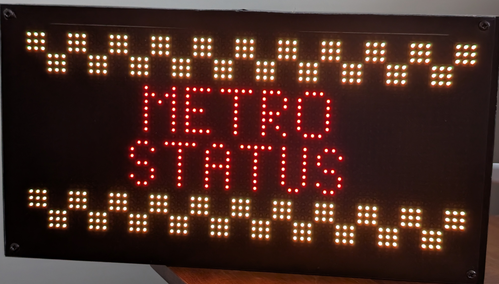
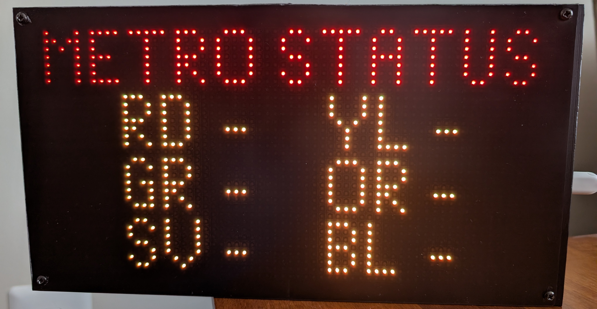

# Editing the Configuration File

Open the [config.py](src/config.py) file located in the root of the _CIRCUITPY_ volume. This file controls the behavior and appearance of the train board. Below is a breakdown of the available settings. There are many settings, but the ones you'll likely want to adjust are that handful that are described first.

The train board displays one or more screens in a rotation, according to the options you define in _config.py_. At the start of each rotation, the application evaluates which screen(s) should be in that rotation. Some screens, particularly the train arrival prediction screens, will be present in every rotation. Others, such as the listing of stations with elevator outages, can be configured to appear in rotation periodically or not at all.

The train arrival prediction screens are customizable in several ways. Each train arrival prediction screen starts with information for one station, which can then be winnowed down further by several criteria. There also are several options that control the way information is provided on the train arrival prediction screens, including which header and columns of information are shown. 

Be careful to use single quotes, brackets, and commas consistent with what is set out in the file.

If you enter this information correctly, then once save the file your board should refresh and provide you with the information you're looking for.

## Settings You're Likely to Adjust

### Train Arrival Prediction Screens

The `train_arrival_screens` list defines what train arrival prediction information to display. Each entry is a python dictionary. There are two entries shown in the default config.py file, but you can have as many entries as you like. Each one becomes a separate screen in the rotation.

| Option | Type | Description |
| --- | --- | --- |
| `station_code` | String | This refers to a WMATA train station code (e.g., `'K01',` for Court House). See the [WMATA Metro Station Codes](https://github.com/GJT-34/wmata_metro_train_board/blob/main/config_options.md#wmata-metro-station-codes) subsection in the Appendix below for a listing of station codes. Information can be displayed for only one station per screen. |
| `lines` | List | This limits what is displayed to specific train lines (e.g., `['OR', 'SV',]`) for a given station. |
| `groups` | List | This limits the display to specific groups (i.e., tracks) (almost always `[1]`, `[2]`, or `[1, 2,]`). See the [Train Groups](https://github.com/GJT-34/wmata_metro_train_board/blob/main/config_options.md#train-groups) subsection in the Appendix below for a listing of how tracks are organized for each train line. Note that if you only show trains for one track at a given station, you may not see any train results if Metro is single-tracking and using the other track to do so! However, you can address this by showing both groups on a single screen, or by showing each group on a different screen. |
| `transit_time` | Integer | This refers to the number of minutes it takes you to travel to the station; trains arriving before this time will be deprioritized in favor of showing those arriving later. However, those arriving before this time will still shown if space allows. For instance, if there are trains arriving in 4, 5, 14, and 15 minutes and your transit time is 10 minutes, then the trains shown will be those arriving in 5, 14, and 15 minutes. (If you configure the screen so that no header is used, then all four trains will be shown.) | 
| `first_columns` | Integer | This is an internal setting for UI layout columns. Options are:   1. Shows a colored arrow to denote the train line and track, and also shows car length, destination and arrival time. This option packs the most information into the display.  2. Shows two-letter abbreviations for the train line, and also shows destination and arrival time. It doesn't show which track each train is on or show the number of cars in each train, but it's the option that most closely resembles a Metro train arrival board.  3. Shows the first letter of the train line (i.e., "R" for Red), shows a colored arrow to denote the track each train is on, and also shows destination and arrival time. This option doesn't include information on the number of cars, but the use of letters for identifying the train line (not just the colored arrow, which also incidates the track) means it could be a fit for someone who's colorblind.|
| `train_header` | Boolean | This determines whether a header is displayed the train arrival prediction screens. If True, the header will be a pre-defined, standard header (either "LN CAR DST MIN" or "LN DEST MIN"), unless you have defined an alternative header using in `alt_header_title`. If False, no header will be displayed and the space will instead be used to display an additional train prediction, meaning up to four would be displayed instead of the usual three.
| `alt_header_title` | String | This is an optional, custom name to display at the top of the train arrival prediction screens, in place of a standard, pre-defined header (either "LN CAR DST MIN" or "LN DEST MIN"). It requires `train_header' to be set to True for this to be displayed. If left blank, the standard, pre-defined header will be used instead. |

| 'first_columns': 1 | 'first_columns': 2 | 'first columns': 3 |
| --- | --- | --- |
|  |  |  |

| 'train_header': True   'alt_header': '' | 'train_header': True   'alt_header': 'Court House'| 'train_header': False |
| --- | --- | --- |
|  |  |  |

### Rail Status, Rail Incident, and Elevator Outage Screens

These options control the visibility of additional screens.

| Option | Type | Default | Description |
| --- | --- | --- | --- |
| `rail_status_display_frequency` | Integer | `120` | This controls the display of a rail status summary screen, which provides an at-a-glance view as to whether any trains have an active alert (shown with a "!") or not (shown with a "-"). Setting this to 0 will ensure the screen appears every rotation, but most users will find this to be too frequent. Setting this to a positive integer determines the minimum number of seconds that must pass before the screen is re-added to the rotation. Setting this to -1 ensures that it does not appear at all. Examples of what this page looks like are shown below, after the [Visual Styling & Colors](https://github.com/GJT-34/wmata_metro_train_board/blob/main/CONFIGURE.md#visual-styling--colors) section. |
| `rail_incident_display_frequency` | Integer | `600` | This controls the display of detailed rail incident (i.e., alerts and advisory) screens. Setting this to 0 will ensure the screens appear every rotation (if there are incidents to display), but most users will find this to be too frequent. Setting this to a positive integer determines the minimum number of seconds that must pass before the screens are re-added to the rotation. Setting this to -1 ensures that the screens do not appear at all. |
| `rail_incident_lines` | List | `['OR', 'SV',]` | This can be used to limit the details of rail incidents to specific train lines. If left empty, it will show all detailed rail incidents. This setting only matters if 'rail_incident_display_frequency' is set to 0 or higher. |
| `elevator_outage_display_frequency` | Integer | `1200` | This controls the display of screens listing stations with elevator outages. Setting this to 0 will ensure the screens appear every rotation (if there are outages to display), but most users will find this to be too frequent. Setting this to a positive integer determines the minimum number of seconds that must pass before the screens are re-added to the rotation. Setting this to -1 ensures that the screens do not appear at all. |

## Settings You're Less Likely to Adjust

### Display & UI Behavior

These settings related to how the screen rotation behaves and how long screens stay active.

| Option | Type | Default | Description |
| --- | --- | --- | --- |
| `start_in_rotating_mode` | Boolean | `True` | If True, the application starts cycling through screens automatically on boot. If False, it stays on the first screen indefinitely, until a button press starts rotation. Note that a train arrival prediction screen will continue to update even if rotation is disabled. |
| `general_rotation_speed` | Integer | `8` | This sets the number of seconds to show a standard train arrival prediction screen. |
| `alerts_rotation_speed` | Integer | `5` | This sets the number of seconds to show an alert or incident description screen(s). |
| `dest_max_characters` | Integer | `8` | This sets the maximum number of characters to display for unchanged destination names on train arrival prediction screens. |
| `show_splash` | Boolean | `True` | If True, this results in a splash transition screen being displayed before showing rail status, rail incident, or elevator outage screen(s). The header on the splash screen varies depending on what information is displayed next. Metro typically uses a splash screen when temporarily switching away from providing train arrivial prediction data. |
| `splash_rotation_speed` | Integer | `2` | This sets the number of seconds to show the splash transition screen. |

| 'show_splash': True |
| --- |
|  |

### Wifi & API Settings

These settings are related to the establishment of a wifi connection and to API usage.

| Option | Type | Default | Description |
| --- | --- | --- | --- |
| `wifi_max_attempts` | Integer | `5` | Number of times to attempt a wifi connection before failing. |
| `metro_api_retries` | Integer | `3` | The number of times to try getting data from a WMATA Metro API before failing. |
| `metro_api_fetch_intermission` | Integer | `20` | Minimum number of seconds between API calls using the same inputs to prevent rate-limiting. Note that none of the WMATA Metro APIs update more often than every 20 seconds. |

### Visual Styling & Colors

Colors are defined in Hex format (`0xRRGGBB`).

| Option | Type | Default | Description |
| --- | --- | --- | --- |
| `text_color` | Hex | `0xFF6600` | This is the color for most text. Currently set to light orange. |
| `text_color_8-car` | Hex | `0x00FF00` | This is the color used to specifically to highlight 8-car trains. Currently set to green. |
| `heading_color` | Hex | `0xFF0000` | This the color used for train prediction arrival headers and other screen headers. Currently set to red. |
| `status_dash_color` | Hex | `0xFF6600` | This is the color for the dash ("-") that appears on the rail status summary page to denote that there are no alerts or advisories for a given train line. Currently set to light orange. |
| `status_exclamation_color` | Hex | `0xFF0000` | This is the color for the exclamation point ("!") that appears on the rail status summary page to denote that there are alerts or advisories for a given train line. Currently set to red. |
| `train_line_color` | Dict | (Map) | This defines the specific color for every WMATA line code, to be used when `show_lines_in_their_colors` is set to True. |
| `indicator_pixels_color` | List | (Colors) | This defines the colors that appear at the bottom row of the screen is response to button short- and long-presses. |
| `show_lines_in_their_colors` | Boolean | `False` | If True, this option will display references to train lines in their color (i.e., the RD line will be displayed as red text). If False, the color defined in text_color will be used. |

| 'show_lines_in_their_colors': True | 'show_lines_in_their_colors': False |
| --- | --- |
|  |  |

### Arrow Directional Layout

| Option | Default | Description |
| --- | --- | --- |
| `group_1_arrow_direction` | `'right'` | The icon direction for Group 1 tracks. |
| `group_2_arrow_direction` | `'left'` | The icon direction for Group 2 tracks. |

### Button Timing

| Key | Type | Default | Description |
|-----|------|---------|-------------|
| `long_press_threshold` | float | `0.5` | Seconds to hold a button before the press is considered "long" |
| `long_blink_time` | float | `0.5` | Duration in seconds of a long indicator blink |
| `short_blink_time` | float | `0.25` | Duration in seconds of a short indicator blink |

## Appendix

### WMATA Metro Station Codes
| Name                                             | Lines                | Code  |
|--------------------------------------------------|----------------------|-------|
| Addison Rd                                       | ['SV', 'BL',]        | 'G03' |
| Anacostia	                                       | ['GR',]              | 'F06' |
| Archives                                         | ['YL', 'GR',]	      | 'F02' |
| Arlington Cemetery	                             | ['BL',]	            | 'C06' |
| Ashburn	                                         | ['SV',]	            | 'N12' |
| Ballston-MU	                                     | ['OR', 'SV',]	      | 'K04' |
| Benning Rd	                                     | ['SV', 'BL',]	      | 'G01' |
| Bethesda	                                       | ['RD',]	            | 'A09' |
| Braddock Rd	                                     | ['YL', 'BL',]	      | 'C12' |
| Branch Av	                                       | ['GR',]              | 'F11' |
| Brookland-CUA                                    | ['RD',]	            | 'B05' |
| Capitol Heights	                                 | ['SV', 'BL',]	      | 'G02' |
| Capitol South	                                   | ['OR', 'SV', 'BL',]	| 'D05' |
| Cheverly	                                       | ['OR',]	            | 'D11' |
| Clarendon	                                       | ['OR', 'SV',]        | 'K02' |
| Cleveland Park                                   | ['RD',]              | 'A05' |
| College Park-U of Md                             | ['GR',]	            | 'E09' |
| Columbia Heights                                 | ['YL', 'GR',]        | 'E04' |
| Congress Heights	                               | ['GR',]	            | 'F07' |
| Court House	                                     | ['OR', 'SV',]	      | 'K01' |
| Crystal City	                                   | ['YL', 'BL',]        | 'C09' |
| Deanwood	                                       | ['OR',]	            | 'D10' |
| Downtown Largo	                                 | ['SV', 'BL',]	      | 'G05' |
| Dunn Loring	                                     | ['OR',]              | 'K07' |
| Dupont Circle	                                   | ['RD',]	            | 'A03' |
| East Falls Church	                               | ['OR', 'SV',]	      | 'K05' |
| Eastern Market	                                 | ['OR', 'SV', 'BL',]	| 'D06' |
| Eisenhower Av	                                   | ['YL',]	            | 'C14' |
| Farragut North	                                 | ['RD',]	            | 'A02' |
| Farragut West	                                   | ['OR', 'SV', 'BL',]	| 'C03' |
| Federal Center SW	                               | ['OR', 'SV', 'BL',]	| 'D04' |
| Federal Triangle	                               | ['OR', 'SV', 'BL',]	| 'D01' |
| Foggy Bottom-GWU	                               | ['OR', 'SV', 'BL',]	| 'C04' |
| Forest Glen	                                     | ['RD',]	            | 'B09' |
| Fort Totten	                                     | ['RD',]	            | 'B06' |
| Fort Totten	                                     | ['YL', 'GR',]	      | 'E06' |
| Franconia-Springfield	                           | ['BL',]	            | 'J03' |
| Friendship Heights	                             | ['RD',]	            | 'A08' |
| Gallery Place	                                   | ['RD',]	            | 'B01' |
| Gallery Place	                                   | ['YL', 'GR',]	      | 'F01' |
| Georgia Av-Petworth	                             | ['YL', 'GR',]        | 'E05' |
| Glenmont	                                       | ['RD',]	            | 'B11' |
| Greenbelt	                                       | ['GR',]	            | 'E10' |
| Greensboro	                                     | ['SV',]	            | 'N03' |
| Grosvenor-Strathmore	                           | ['RD',]	            | 'A11' |
| Herndon	                                         | ['SV',]	            | 'N08' |
| Huntington	                                     | ['YL',]	            | 'C15' |
| Hyattsville Crossing	                           | ['GR',]	            | 'E08' |
| Innovation Center	                               | ['SV',]	            | 'N09' |
| Judiciary Sq	                                   | ['RD',]	            | 'B02' |
| King St-Old Town	                               | ['YL', 'BL',]	      | 'C13' |
| Landover	                                       | ['OR',]	            | 'D12' |
| L'Enfant Plaza	                                 | ['OR', 'SV', 'BL',]  | 'D03' |
| L'Enfant Plaza	                                 | ['YL', 'GR',]	      | 'F03' |
| Loudon Gateway	                                 | ['SV',]	            | 'N11' |
| McLean	                                         | ['SV',]	            | 'N01' |
| McPherson Sq	                                   | ['OR', 'SV', 'BL',]	| 'C02' |
| Medical Center	                                 | ['RD',]	            | 'A10' |
| Metro Center	                                   | ['RD',]	            | 'A01' |
| Metro Center	                                   | ['OR', 'SV', 'BL',]	| 'C01' |
| Minnesota Av	                                   | ['OR',]	            | 'D09' |
| Morgan Blvd	                                     | ['SV', 'BL',]	      | 'G04' |
| Mt Vernon Sq	                                   | ['YL', 'GR',]	      | 'E01' |
| Navy Yard-Ballpark	                             | ['GR',]	            | 'F05' |
| Naylor Rd	                                       | ['GR',]	            | 'F09' |
| New Carrollton	                                 | ['OR',]	            | 'D13' |
| NoMa-Gallaudet U	                               | ['RD',]	            | 'B35' |
| North Bethesda	                                 | ['RD',]	            | 'A12' |
| Pentagon	                                       | ['YL', 'BL',]	      | 'C07' |
| Pentagon City	                                   | ['YL', 'BL',]	      | 'C08' |
| Potomac Av	                                     | ['OR', 'SV', 'BL',]	| 'D07' |
| Potomac Yard	                                   | ['YL', 'BL',]	      | 'C11' |
| Reston Town Center	                             | ['SV']	              | 'N07' |
| Rhode Island Av	                                 | ['RD']	              | 'B04' |
| Rockville	                                       | ['RD']	              | 'A14' |
| Ronald Reagan Washington National Airport	       | ['YL', 'BL']	        | 'C10' |
| Rosslyn	                                         | ['OR', 'SV', 'BL']	  | 'C05' |
| Shady Grove	                                     | ['RD',]	            | 'A15' |
| Shaw-Howard U	                                   | ['YL', 'GR',]	      | 'E02' |
| Silver Spring	                                   | ['RD',]	            | 'B08' |
| Smithsonian	                                     | ['OR', 'SV', 'BL',]	| 'D02' |
| Southern Av	                                     | ['GR',]	            | 'F08' |
| Spring Hill	                                     | ['SV',]	            | 'N04' |
| Stadium-Armory	                                 | ['OR', 'SV', 'BL',]	| 'D08' |
| Suitland	                                       | ['GR',]	            | 'F10' |
| Takoma	                                         | ['RD',]	            | 'B07' |
| Tenleytown-AU	                                   | ['RD',]	            | 'A07' |
| Twinbrook	                                       | ['RD',]	            | 'A13' |
| Tysons	                                         | ['SV',]	            | 'N02' |
| U St	                                           | ['YL', 'GR',]	      | 'E03' |
| Union Station	                                   | ['RD',]	            | 'B03' |
| Van Dorn St	                                     | ['BL',]	            | 'J02' |
| Van Ness-UDC	                                   | ['RD',]	            | 'A06' |
| Vienna	                                         | ['OR',]	            | 'K08' |
| Virginia Sq-GMU	                                 | ['OR', 'SV',]	      | 'K03' |
| Washington Dulles International Airport	         | ['SV',]	            | 'N10' |
| Waterfront	                                     | ['GR',]	            | 'F04' |
| West Falls Church	                               | ['OR',]	            | 'K06' |
| West Hyattsville	                               | ['GR',]	            | 'E07' |
| Wheaton	                                         | ['RD',]	            | 'B10' |
| Wiehle-Reston East	                             | ['SV',]	            | 'N06' |
| Woodley Park	                                   | ['RD',]	            | 'A04' |

### Train Groups
A special thanks to [u/SandBoxJohn](https://www.reddit.com/user/SandBoxJohn) for these.

| Line       | Train Group | Destination                                            |
|------------|-------------|--------------------------------------------------------|
| RD         | 1           | Glenmont                                               |
| RD         | 2           | Shady Grove                                            |
| OR, SV, BL | 1           | New Carrollton, Downtown Largo                         |
| OR, SV, BL | 2           | Vienna, Franconia-Springfield, Ashburn                 |
| YL, GR     | 1           | Greenbelt                                              |
| YL, GR     | 2           | Huntington, Branch Av                                  |
| N/A        | 3           | Center Platform at Ronald Reagan Washington National Airport, West Falls Church |

Next: [Using the train board](https://github.com/GJT-34/wmata_metro_trainboard/blob/main/USAGE.md)
