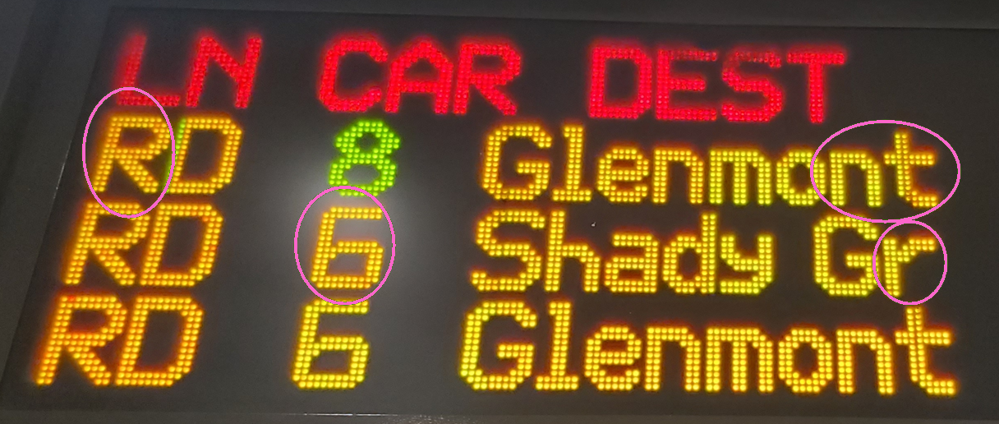
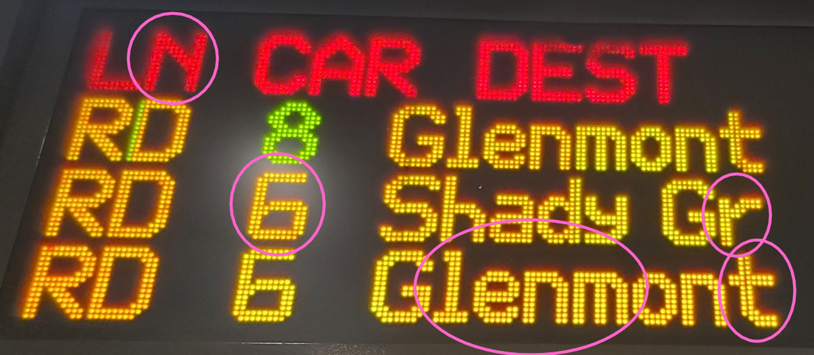

[I'm reworking the code for this right now, including an upgrade to CircuitPython 10. Until it's ready, don't follow the instructions on this page.]

# WMATA Metro Train Board

This project contains the source code to create your own WMATA Metro Train Board. It was written using CircuitPython targeting the [Adafruit Matrix Portal S3](https://www.adafruit.com/product/5778) and 64x32 RGB LED matrices. Features include:
- The ability to auto-rotate through multiple "screens," which can be used to display information on more than one station or on separate groups (i.e., tracks or platforms) at the same station
- The ability to control the screens through buttons on the MatrixPortal in addition to auto-rotation.
- A font customized to resemble the font WMATA uses on its train boards.
- The ability to prioritize the display of train that are predicted to arrive at a station only after you can get to that station.
- Multiple options for displaying train line, car length, and group/track information.
- Multiple options for what is displayed in the header for each train arrival prediction screen, and for omitting the header altogether.
- The ability to display information on Metro's status, rail alerts, and elevator outages.

## Background

Metro's first generation of digital train arrival boards--which WMATA calls passenger information display system (PIDS) monitors--have been a familiar sight since their introduction in October 2000. They've been ubiquitous at Metro stations, typically with a couple boards at each track and sometimes at one or more at station entrances as well. Many millions of riders have seem them, given that Metro routinely has averaged over 100 million rides a year since these train boards were implemented. 

The boards consist of LED panels with extremely limited pixel density and color capabilities. Despite having a diagonal size of around three feet, they only have a resolution of 192x68 pixels. To put that into perspective, a typical phone these days will have typical pixel density of 300 to over 500 pixels per inch (PPI). Metro's panels also show only red, green, and yellow colors. Metro has begun phasing out these train boards in favor of a new generation of displays, but the idea of a do-it-yourself, old-school Metro train arrival board still has some appeal. 

In November 2020, a [project](https://github.com/metro-sign/dc-metro) landed on github that allowed people to make their own Metro train arrival boards. The only hardware needed was a LED panel and a controller device called the MatrixPortal M4, which could be purchased together for around $65 on Adafruit, before shipping and taxes. Anyone looking to implement this project also needed to obtain a free API key from WMATA. The LED panel recommended for that project has a pixel resolution of just 64x32. That's not an exact match for what Metro uses, but it's similar. The project received some online attention, such as this DCist [article](https://dcist.com/story/23/03/16/heres-how-to-build-your-own-mini-metro-arrival-screen-for-your-home-or-office/). 

I became one of several people who decided to set up forks on github of the original project, which has not been updated since 2000. At the time, my main contribution was to edit the default font to more closely resemble the font on Metro's train boards. This was a little tricky not only because of the space considerations of the 64x32 screen, but because it turned out Metro's train boards use multiple fonts with subtle differences. You can see some examples in these train board pics:

The software now has more features than the original 2020 version, as noted at the top of this document. A consequence of this is that one of the hardware requirements for this project has changed. The project originally called for the use of the MatrixPortal M4 to control the LED panel. Because the additional features use more memory than the original version, this code is designed to run on the MatrixPortal S3. The S3 has far more memory than the M4, which is no longer for sale.

The goal this project is to build a display that resembles a Metro train board, but I've made a few exceptions. These include changes needed to account for the lack of space in the LED panel, to provide information that Metro's train boards don't provide, and to remove information that Metro's train boards provide, but which you may not want. 

Anyway, let's get to it.

## Prerequisites

### Hardware

- A [Matrix Portal S3](https://www.adafruit.com/product/5778). You can buy the S3 directly from Adafruit at the link above, but I found mine at Micro Center. 
- A **64x32 RGB LED matrix** compatible with the _Matrix Portal_. The version in the pictures above is from my 5mm panel.
    - [64x32 RGB LED Matrix - 3mm pitch](https://www.adafruit.com/product/2279)
    - [64x32 RGB LED Matrix - 4mm pitch](https://www.adafruit.com/product/2278)
    - [64x32 RGB LED Matrix - 5mm pitch](https://www.adafruit.com/product/2277)
    - [64x32 RGB LED Matrix - 6mm pitch](https://www.adafruit.com/product/2276)
- A **USB-C power supply**. 15w phone adapters (5V/3A) should work fine, while underpowered adapters can lead to MatrixPortal not running properly, or at all.
- A **USB-C cable** that can connect your computer/power supply to the MatrixPortal. You'll be transferring some files to the MatrixPortal, so make sure it's a USB-C cable that handle data transfers, not just power delivery.
- A **3-D printed case** that can hold the MatrixPortal and LED panel. This is optional, but it helps hide the wires behind the LED panel. I have one, but I don't recall where I got the design from.
- A [LED diffusion acrylic panel](https://www.adafruit.com/product/4594). This is also optional, but it helps tone down the lights on the LED panel. This is useful because the lights are far brighter than the pictures suggest. 

### Tools
- A small phillips head screwdriver
- A hot glue gun _(optional)_
- Tape _(optional)_
- Zip ties _(optional)_

## Setup and Usage
- 
- 
- 
- 
