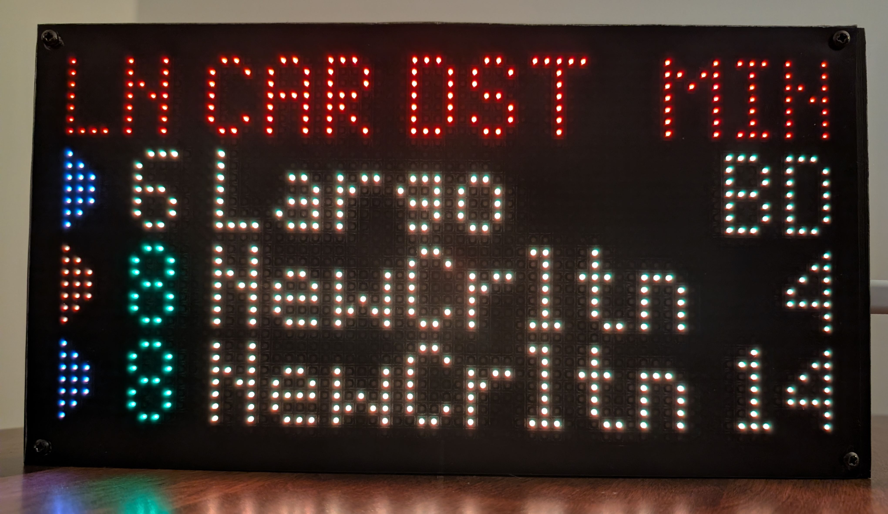
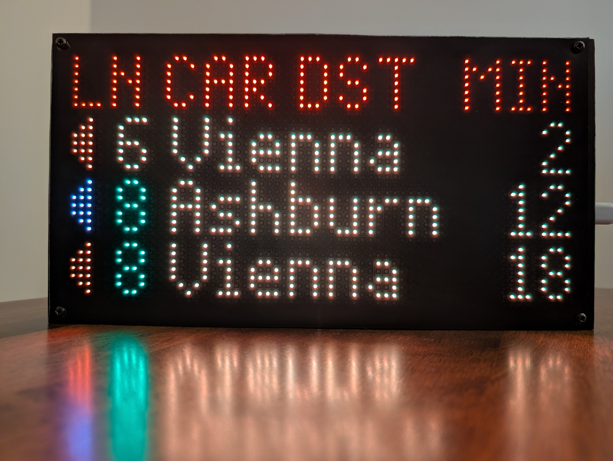
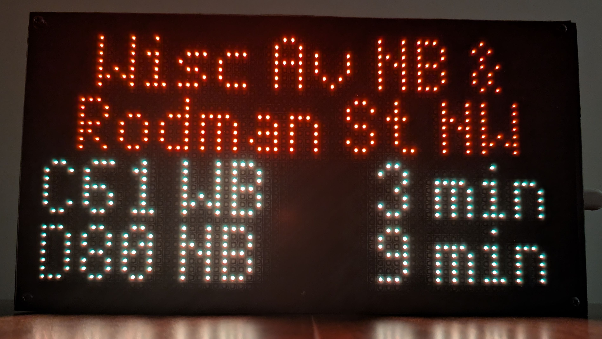
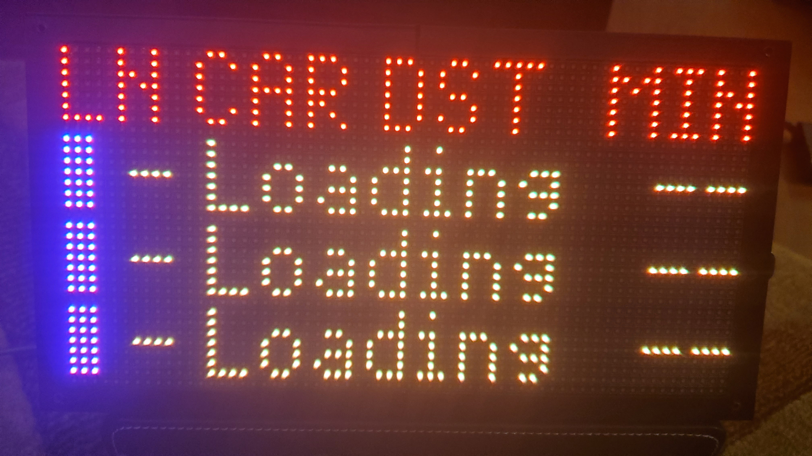

[I'm reworking the code right now, including an upgrade to CircuitPython 10. Until it's ready, don't follow the instructions on this page.]

# Washington DC Metro Train Sign
This project contains the source code to create your own Washington DC Metro sign, using data from WMATA's API for real-time rail predictions. It was written using CircuitPython targeting the [Adafruit Matrix Portal M4](https://www.adafruit.com/product/4745) and is optimized for 64x32 RGB LED matrices.

Some of its features include:
- A customized font that attempts to mimic the font that Metro uses on its signs.
- The ability to display multiple "screens," which can be used to display information on more than one station or on separate groups (i.e., tracks or platforms) at the same station. The board will auto-rotate through the screens on a configurable basis, and manual rotation is provided using the UP (freeze/unfreeze rotation) and DOWN (next screen) buttons.
- The ability to exclude trains that will arrive at a station before you can walk to that station.
- Multiple options for displaying line, car length, and group/track information.
- Multiple options for what is displayed in the header for each screen, and for omitting the header altogether.





# How To
## Hardware
- A [Matrix Portal M4](https://www.adafruit.com/product/4745) or [Matrix Portal S3](https://www.adafruit.com/product/5778). The M4 is no longer available for sale, but the S3 is newer and better. You can buy it directly from Adafruit at the link above, but I found mine at Micro Center. 
- A **64x32 RGB LED matrix** compatible with the _Matrix Portal_.
    - [64x32 RGB LED Matrix - 3mm pitch](https://www.adafruit.com/product/2279)
    - [64x32 RGB LED Matrix - 4mm pitch](https://www.adafruit.com/product/2278)
    - [64x32 RGB LED Matrix - 5mm pitch](https://www.adafruit.com/product/2277)
    - [64x32 RGB LED Matrix - 6mm pitch](https://www.adafruit.com/product/2276)
- A **USB-C power supply**. 15w phone adapters (5V/3A) should work fine, while underpowered adapters can lead to board not running properly, or at all.
- A **USB-C cable** that can connect your computer/power supply to the board.

## Tools
- A small phillips head screwdriver
- A hot glue gun _(optional)_
- Tape _(optional)_
- Zip ties _(optional)_

## Part 1: Prepare the Board
1. Use a hot glue gun to cover the sharp screws on the right-hand side of the 64x32 LED matrix, if present. This step is optional, but it may prevent wire chafing later on.

    

2. Remove any transparent yellow stickers on the posts of the _Matrix Portal_ and lightly screw in the phillips head screws into the posts. These only need to go down about 60% of the way for now.

    

3. Using the power cable provided with 64x32 matrix, slide the prong for the **red power cable** between the post and the screw on the port labeled **5v**. Tighten down this screw all the way using your screwdriver. Repeat the same for the **black power cable** and the **GND** port.

    
    

4. Connect the _Matrix Portal_ to the large connector on the left-hand side of the back of the 64x32 matrix.

    

5. Plug one of the power connectors into the right-hand side of the 64x32 matrix.

    

6. You can use tape or zip ties to prevent the cables from flopping around.

    

## Part 2: Loading the Software
1. Connect the board to your computer using a USB-C cable. Double click the button on the board labeled _RESET_. The board should mount onto your computer as a storage volume, most likely named _MATRIXBOOT_.
    
    

2. Flash your _Matrix Portal_ with the latest release of CircuitPython 10.
    - Download the firmware from Adafruit, using the proper version for the [M4](https://circuitpython.org/board/matrixportal_m4/) or [S3](https://circuitpython.org/board/adafruit_matrixportal_s3/), depending on which _Matrix Portal_ type you're using.
    - If CircuitPython 10.X.X is no longer the current version, you can still find it using the links in the "Previous Versions of CircuitPython" section of the page that is linked to immediately above. Use the most recent 10.X.X. release available. 
    - Drag the downloaded _.uf2_ file into the root of the _MATRIXBOOT_ volume.
    - The board will automatically flash the version of CircuitPython and remount as _CIRCUITPY_.
    - If something goes wrong, refer to the [Adafruit Documentation](https://learn.adafruit.com/adafruit-matrixportal-m4/install-circuitpython).

3. Decompress the _lib.zip_ file from this repository into the root of the _CIRCUITPY_ volume. There should be one folder named _lib_, with a plethora of files underneath. You can delete _lib.zip_ from the _CIRCUITPY_ volume, as it's no longer needed.

    - It has been reported that this step may fail ([Issue #2](https://github.com/metro-sign/dc-metro/issues/2)), most likely due to the storage on the Matrix Portal not being able to handle the decompression. If this happens, unzip the _lib.zip_ file on your computer, and copy the _lib_ folder to the Matrix Portal. Command line tools could also be used if the above doesn't work.

    

4. Download this repository as a ZIP file by selecting the green 'Code' button at the top of this page, and then unzip the file.

5. Copy all of the Python files from the downloaded repository into the root of the _CIRCUITPY_ volume, and also copy _Metroesque.bdf_ into the _lib_ folder referred to earler.

    

6. The board should now light up with a loading screen, but we've still got some work to do.

    

## Part 3: Getting a WMATA API Key
1. Create a WMATA developer account on [WMATA's Developer Website](https://developer.wmata.com/signup/).

2. After your account is created, add the _Default Tier_ subscription to your account on [this page](https://developer.wmata.com/products/5475f1b0031f590f380924fe).

3. After doing this, you will be redirected to [your profile](https://developer.wmata.com/developer).

4. Under the _Subscriptions_ section on your profile, select the **show** button beside the _Primary Key_. This is the key that allows the board to communicate with WMATA.

## Part 4: Setting Up the Board to Connect to WMATA
1. Open the [settings.toml](src/settings.toml) file located in the root of the _CIRCUITPY_ volume.

2. Fill in your wifi SSID and password and WMATA API key.

3. Save this file. At this point, your board should refresh and connect to WMATA.

## Part 5: Configuring/Using the Board
1. Open the [config.py](src/config.py) file located in the root of the _CIRCUITPY_ volume

2. There are several configuration entries here, but the only ones you need to edit are in the _screen_, at the top. The rest are optional. 

3. You can display train information on one or more screens (such as having one screen each for two nearby stations) by updating the values in _screen_ and adding additional information as needed. If there is more than one set of _screens_ entries, the display will rotate between them every few seconds. In _screens_:
 
    - Use the [Metro Station Codes table](#dc-metro-station-codes) at the bottom of this page to set the _metro_station_code_ value. You can only use one station per screen, but you can set up additional screens if you have other stations you want to show.
      
    - Update the _station_name_ value. This value may be displayed depending on other configuration changes you make. You may need to shorten the name to fit on the screen. (The screen can accommodate about 12 characters across.)
      
    - Update the _lines_ value with the lines you want displayed, as set out in the Metro Stations Codes table.
  
    - Use [Train Group table](#train-group-explanations) to update the _train_group_ value. A train group is basically WMATA's terminology for "platform" or "track". The value needs to be 1, 2, and/or 3. This value determines which platform's arrival times will be displayed. Note that single tracking can cause a train that would normally be in one group to temporarily be in another.
    
    - For _show_all_groups_if_nothing_else_, the value needs to be either ***True*** or ***False***. This determines what the board should do if there are no trains with assigned lines in your selected group. If True, the board will attempt to show results from all groups instead. This can help during single-tracking, when one group is temporarily reassigned to the other. If False, it will show the results from the selected group, which at most will consist of 'No Psngr' trains with no assigned lines.
      
    - Update _walking_time_ to provide the number of minutes it takes for you to get to the station; trains will be excluded from being displayed if they will reach the station before you can arrive there.
  
    - Use the [First Columns Options](#first-columns-options) table below to update _first_columns_ according to how you want the display to show line, car length, and track information.
  
    - Use the [Header Type Options](#header-type-options) table to update _header_type to show whether you want the display's header to show the categories of train information in the display (i.e., "LN DEST  MIN"), to show the station's name, or to disappear completely so the space can be used to show an additional row of train information.

4. In the end, the first part of your configuration file should look similar to what's below. If you only want to show one screen of information, then delete the second set of curly braces (the "{" and "}" characters) and everything in between. Be careful to use single quotes, brackets, and commas consistent with what is set out below.

```python
    'screen': [
        {
            'station_code': 'A02',
            'station_name': 'Frgut N',
            'lines': ['RD'],
            'groups': [1, 2],           
            'walking_time': 0,
            'first_columns': 1,
            'header_type': 1
        },
        {
            'station_code': 'C03',
            'station_name': 'Frgut W',
            'lines': ['BL', 'OR', 'SV'], 
            'groups': [1, 2],           
            'walking_time': 0,
            'first_columns': 4,
            'header_type': 1
        }
    ],
    ...
```

5. If you enter this information correctly, then once save the file your board should refresh and provide you with information on your station(s).

6. Additional options in the config.py file are explained within the file itself. Among other things, these options address how, and how often, the display will rotate through multiple screens. They also allow changes to some of the colors the display uses and how the code deals with single tracking.
   
7. If the device is set up with multiple screens, the device's UP and DOWN buttons can provide manual rotation control. A press of the device's UP button will freeze the display on the current screen, with a red line flashing once at the bottom of the display to provide feedback that the device registered the button press). A subsequent press will unfreeze it, with the red line flashing twice. The device's DOWN button will manually trigger the next screen, with green line flashing once at the bottom of the display. 

## Troubleshooting
If something goes wrong, take a peek at the [Adafruit Documentation](https://learn.adafruit.com/adafruit-matrixportal-m4). Additionally, you can connect to the board using a serial connection to gain access to its logging.

# Appendix
## DC Metro Station Codes
| Name                                             | Lines      | Code |
|--------------------------------------------------|------------|------|
| Addison Road-Seat Pleasant                       | ['BL', 'SV']       | 'G03' |
| Anacostia                                        | ['GR']             | 'F06' |
| Archives-Navy Memorial-Penn Quarter              | ['GR', 'YL']       | 'F02' |
| Arlington Cemetery                               | ['BL']             | 'C06' |
| Ashburn                                          | ['SV']             | 'N12' |
| Ballston-MU                                      | ['OR', 'SV']       | 'K04' |
| Benning Road                                     | ['BL', 'SV']       | 'G01' |
| Bethesda                                         | ['RD']             | 'A09' |
| Braddock Road                                    | ['BL', 'YL']       | 'C12' |
| Branch Ave                                       | ['GR']             | 'F11' |
| Brookland-CUA                                    | ['RD']             | 'B05' |
| Capitol Heights                                  | ['BL', 'SV']       | 'G02' |
| Capitol South                                    | ['BL', 'OR', 'SV'] | 'D05' |
| Cheverly                                         | ['OR']             | 'D11' |
| Clarendon                                        | ['OR', 'SV']       | 'K02' |
| Cleveland Park                                   | ['RD']             | 'A05' |
| College Park-U of Md                             | ['GR']             | 'E09' |
| Columbia Heights                                 | ['GR', 'YL']       | 'E04' |
| Congress Heights                                 | ['GR']             | 'F07' |
| Court House                                      | ['OR', 'SV']       | 'K01' |
| Crystal City                                     | ['BL', 'YL']       | 'C09' |
| Deanwood                                         | ['OR']             | 'D10' |
| Downtown Largo                                   | ['BL', 'SV']       | 'G05' |
| Dunn Loring-Merrifield                           | ['OR']             | 'K07' |
| Dupont Circle                                    | ['RD']             | 'A03' |
| East Falls Church                                | ['OR', 'SV']       | 'K05' |
| Eastern Market                                   | ['BL', 'OR', 'SV'] | 'D06' |
| Eisenhower Avenue                                | ['YL']             | 'C14' |
| Farragut North                                   | ['RD']             | 'A02' |
| Farragut West                                    | ['BL', 'OR', 'SV'] | 'C03' |
| Federal Center SW                                | ['BL', 'OR', 'SV'] | 'D04' |
| Federal Triangle                                 | ['BL', 'OR', 'SV'] | 'D01' |
| Foggy Bottom-GWU                                 | ['BL', 'OR', 'SV'] | 'C04' |
| Forest Glen                                      | ['RD']             | 'B09' |
| Fort Totten                                      | ['RD']             | 'B06' |
| Fort Totten                                      | ['GR', 'YL']       | 'E06' |
| Franconia-Springfield                            | ['BL']             | 'J03' |
| Friendship Heights                               | ['RD']             | 'A08' |
| Gallery Pl-Chinatown                             | ['RD']             | 'B01' |
| Gallery Pl-Chinatown                             | ['GR', 'YL']       | 'F01' |
| Georgia Ave-Petworth                             | ['GR', 'YL']       | 'E05' |
| Glenmont                                         | ['RD']             | 'B11' |
| Greenbelt                                        | ['GR']             | 'E10' |
| Greensboro                                       | ['SV']             | 'N03' |
| Grosvenor-Strathmore                             | ['RD']             | 'A11' |
| Herndon                                          | ['SV']             | 'N08' |
| Huntington                                       | ['YL']             | 'C15' |
| Hyattsville Crossing                             | ['GR']             | 'E08' |
| Innovation Center                                | ['SV']             | 'N09' |
| Judiciary Square                                 | ['RD']             | 'B02' |
| King St-Old Town                                 | ['BL', 'YL']       | 'C13' |
| Landover                                         | ['OR']             | 'D12' |
| L'Enfant Plaza                                   | ['BL', 'OR', 'SV'] | 'D03' |
| L'Enfant Plaza                                   | ['GR', 'YL']       | 'F03' |
| Loudon Gateway                                   | ['SV']             | 'N11' |
| McLean                                           | ['SV']             | 'N01' |
| McPherson Square                                 | ['BL', 'OR', 'SV'] | 'C02' |
| Medical Center                                   | ['RD']             | 'A10' |
| Metro Center                                     | ['RD']             | 'A01' |
| Metro Center                                     | ['BL', 'OR', 'SV'] | 'C01' |
| Minnesota Ave                                    | ['OR']             | 'D09' |
| Morgan Boulevard                                 | ['BL', 'SV']       | 'G04' |
| Mt Vernon Sq 7th St-Convention Center            | ['GR', 'YL']       | 'E01' |
| Navy Yard-Ballpark                               | ['GR']             | 'F05' |
| Naylor Road                                      | ['GR']             | 'F09' |
| New Carrollton                                   | ['OR']             | 'D13' |
| NoMa-Gallaudet U                                 | ['RD']             | 'B35' |
| North Bethesda                                   | ['RD']             | 'A12' |
| Pentagon                                         | ['BL', 'YL']       | 'C07' |
| Pentagon City                                    | ['BL', 'YL']       | 'C08' |
| Potomac Ave                                      | ['BL', 'OR', 'SV'] | 'D07' |
| Potomac Yard                                     | ['BL', 'YL']       | 'C11' |
| Reston Town Center                               | ['SV']             | 'N07' |
| Rhode Island Ave-Brentwood                       | ['RD']             | 'B04' |
| Rockville                                        | ['RD']             | 'A14' |
| Ronald Reagan Washington National Airport        | ['BL', 'YL']       | 'C10' |
| Rosslyn                                          | ['BL', 'OR', 'SV'] | 'C05' |
| Shady Grove                                      | ['RD']             | 'A15' |
| Shaw-Howard U                                    | ['GR', 'YL']       | 'E02' |
| Silver Spring                                    | ['RD']             | 'B08' |
| Smithsonian                                      | ['BL', 'OR', 'SV'] | 'D02' |
| Southern Avenue                                  | ['GR']             | 'F08' |
| Spring Hill                                      | ['SV']             | 'N04' |
| Stadium-Armory                                   | ['BL', 'OR', 'SV'] | 'D08' |
| Suitland                                         | ['GR']             | 'F10' |
| Takoma                                           | ['RD']             | 'B07' |
| Tenleytown-AU                                    | ['RD']             | 'A07' |
| Twinbrook                                        | ['RD']             | 'A13' |
| Tysons                                           | ['SV']             | 'N02' |
| U Street/African-Amer Civil War Memorial/Cardozo | ['GR', 'YL']       | 'E03' |
| Union Station                                    | ['RD']             | 'B03' |
| Van Dorn Street                                  | ['BL']             | 'J02' |
| Van Ness-UDC                                     | ['RD']             | 'A06' |
| Vienna/Fairfax-GMU                               | ['OR']             | 'K08' |
| Virginia Square-GMU                              | ['OR', 'SV']       | 'K03' |
| Washington Dulles International Airport          | ['SV']             | 'N10' |
| Waterfront                                       | ['GR']             | 'F04' |
| West Falls Church                                | ['OR']             | 'K06' |
| West Hyattsville                                 | ['GR']             | 'E07' |
| Wheaton                                          | ['RD']             | 'B10' |
| Wiehle-Reston East                               | ['SV']             | 'N06' |
| Woodley Park-Zoo/Adams Morgan                    | ['RD']             | 'A04' |

## Train Group Explanations
A special thanks to [u/SandBoxJohn](https://www.reddit.com/user/SandBoxJohn) for these.

| Line       | Train Group | Destination                                            |
|------------|-------------|--------------------------------------------------------|
| RD         | 1           | Glenmont                                               |
| RD         | 2           | Shady Grove                                            |
| BL, OR, SV | 1           | New Carrollton, Largo Town Center                      |
| BL, OR, SV | 2           | Vienna, Franconia-Springfield, Ashburn                 |
| GR, YL     | 1           | Greenbelt                                              |
| GR, YL     | 2           | Huntington, Branch Avenue                              |
| N/A        | 3           | Center Platform at National Airport, West Falls Church |
