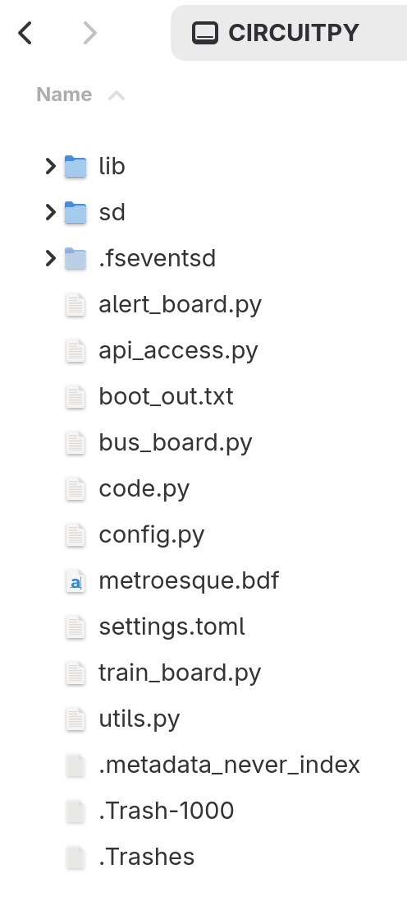

# Installing the Software

1. Connect the Matrix Portal to your computer using a USB-C cable that is capable of data transfers. Double click the button on the Matrix Portal labeled _RESET_. The Matrix Portal should mount onto your computer as a storage volume, most likely named _MATRXS3BOOT_.
    
    

2. Flash your _Matrix Portal_ with the latest release of CircuitPython 10.
- Download the current 10.X.X version of the _*.uf2_ firmware from Adafruit, using the proper version for the [Matrix Portal S3](https://circuitpython.org/board/adafruit_matrixportal_s3/). If CircuitPython 10 is no longer the current version, you can still find it using the links in the "Previous Versions of CircuitPython" section of the page in the prior link. Use the most recent 10.X.X. release available. 
- Drag the downloaded _.uf2_ file into the root of the _MATRXS3BOOT_ volume.
- The board will automatically flash the version of CircuitPython and remount as _CIRCUITPY_.
- If something goes wrong, refer to the [Adafruit Documentation](https://learn.adafruit.com/adafruit-matrixportal-s3/install-circuitpython). Note that the S3 has some additional installation methods beyond what I've described above, so if one doesn't work you can try another.

3. Obtain a WMATA API key.

- Create a WMATA developer account on [WMATA's Developer Website](https://developer.wmata.com/signup/).
- After your account is created, add the _Default Tier_ subscription to your account on [this page](https://developer.wmata.com/products/).
- After doing this, you will be redirected to [your profile](https://developer.wmata.com/profile).
- Under the _Subscriptions_ section on your profile, select the _show_ link beside the _Primary Key_. This will show the key that allows the board to communicate with WMATA. Keep this key handy, as you'll need this shortly.

4. Download the files in this repository (i.e., wmata_metro_train_board) as a ZIP file by selecting the green _Code_ button at the top of this repository's [home page](https://github.com/GJT-34/wmata_metro_train_board), selecting the _Local_ tab, and selecting the _Download ZIP_ link.

5. Where you have downloaded the ZIP file on your computer, decompress it. It will create a new folder on your computer called _wmata_metro_train_board-main_.
   
6. In this new folder will be a folder called _src_, and in the folder will be file called _lib.zip_. Copy this file to the root of the _CIRCUITPY_ volume and decompress it. It will create a new folder named _lib_ with multiple files in it. It's possible that you already have a folder called _lib_ in your _CIRCUITPY_ volume. If this is the case, a new folder called _lib (2)_ will be created. Copy all the files from _lib (2)_ into _lib_ and delete _lib (2)_. Also delete _lib.zip_ from the _CIRCUITPY_ volume, as it's no longer needed.

7. Going back to the _src_ folder on your computer, in that folder will be a file called _settings.toml_ that you need to edit. Open this file and fill in your wifi SSID, wifi password, and WMATA API key, replacing the mock data within the quotation marks. Save the file.

8. Copy the remaining files in the _src_ folder (including the edited _settings.toml_ file, but not the _lib.zip_ file that you copied already) to the root of the Matrix Portal's _CIRCUITPY_ volume. The final file structure should include the following:

    

9. The board should now light up and say "Loading..." and then begin trying to connect to wifi.
  
If everything has gone successfully, after a few seconds your board should begin displaying data. We still need to edit the configuration so it shows the right data, though. That's the next step.

Next: [Editing the configuration file](https://github.com/GJT-34/wmata_metro_train_board/blob/main/CONFIGURE.md)
