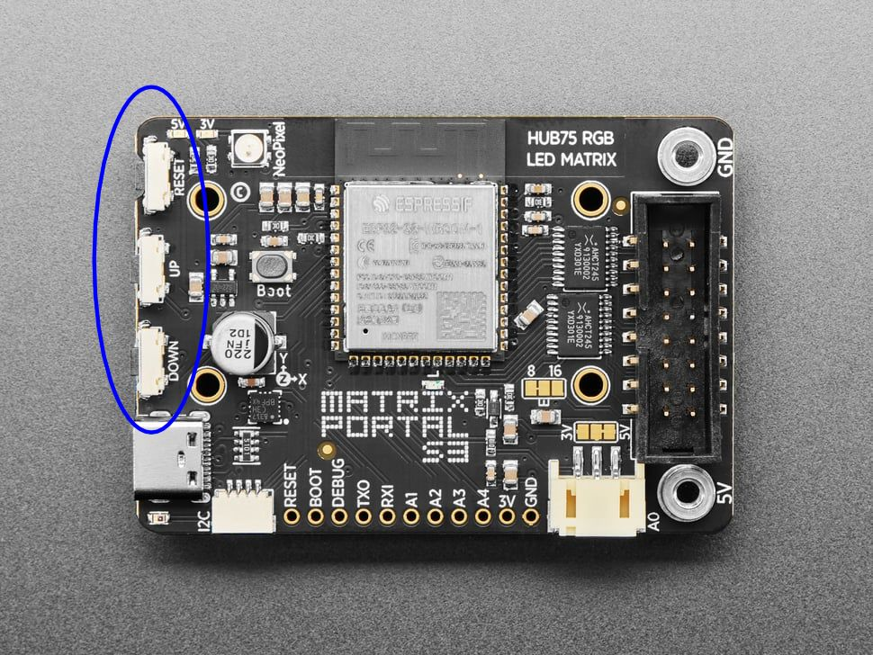

# Using the Train Board

For the most part, using the train board is a matter of turning it on and glancing at the screen periodically. However, there are some tips that can help you optimize your use of the board.

## Button Presses

The Matrix Portal has three buttons on it:
- RESET
- UP
- DOWN

The UP and DOWN buttons are the ones nearest the USB-C port. The RESET button is to be avoided unless you're having problems with the board.

The UP and DOWN buttons recognize long presses (i.e., presses of over half a second) and short presses, which together are used to give the train board these four options:

- **UP button long press**: This toggles screens between rotating and stationary modes. After you release the button, a row of pixels at the bottom of the screen will blink red to confirm the button long press.
  - Single red blink: The board is in stationary mode.
  - Double red blink: The board is in rotating mode.
- **UP button short press**: This advances the display to the next screen, even if the screens are in stationary mode. After you release the button, a row of pixels at the bottom of the screen will blink blue once to confirm the button short press. 

- **DOWN button long press**: This toggles the display of detailed rail alerts, if any. After you release the button, a row of pixels at the bottom of the screen will blink yellow to confirm the button long press.
  - Single yellow blink: The display of detailed rail alert screens is turned off.
  - Double yellow blink: The display of detailed rail alert screens is turned on.
- **DOWN button short press**: This toggles the display of stations with elevator outages, if any. After you release the button, a row of pixels at the bottom of the screen will blink cyan to confirm the button short press. 
  - Single cyan blink: The display of stations with elevator outages is turned off.
  - Double cyan blink: The display of stations with elevator outages is turned on.

## Controlling Power to the Board

I've seen some train board forks that provide configuration options to stop the board from trying to get API data at certain times, particularly while the Metrorail system is closed. There are no such options in this version. Instead, I suggest getting a smart plug. Smart plugs are inexpensive and offer a lot of configurable options, and it only takes a few seconds for the board to boot from a cold start.

## Additional Help

Adafruit has a lot of [documentation](https://circuitpython.org/board/adafruit_matrixportal_s3/) on CircuitPython running on the Matrix Portal S3, including information that can be helpful for troubleshooting. It's a good place to start if you run into issues.
