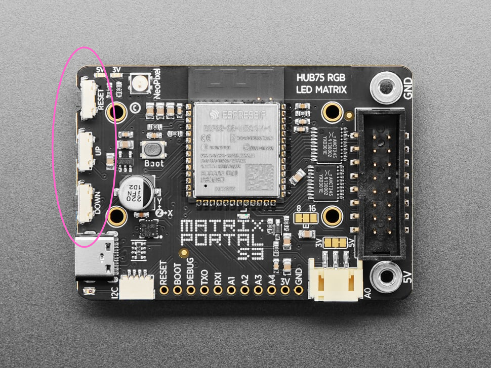

# Using the Train Board

## Button Presses

The MatrixPortal has three buttons on it, in this order:
- RESET
- UP
- DOWN

The UP and DOWN buttons are the ones nearest the USB-C port. The RESET button is to be avoided unless you're having problems with the board.

The UP and DOWN buttons recognize long presses (i.e., presses of over half a second) and short presses. Accordingly, there are four options associated with the UP and DOWN buttons.

- UP button long press: This toggles screens between rotating and stationary modes. After you release the button, a row of pixels at the bottom of the screen will blink red.
  - Single red blink: The board is in stationary mode.
  - Double red blink: The board is in rotating mode.
- UP button short press: This advances the display to the next screen, even if the screens are in stationary mode. After you release the button, a row of pixels at the bottom of the screen will blink blue once. 

- DOWN button long press: This toggles the display of detailed rail incidents, if any. After you release the button, a row of pixels at the bottom of the screen will blink yellow.
  - Single yellow blink: The display of detailed rail incident screens is turned off.
  - Double yellow link: The display of detailed rail incident screens is turned on.
- DOWN button short press: This toggles the display of stations with elevator outages, if any. After you release the button, a row of pixels at the bottom of the screen will blink cyan. 
  - Single cyan blink: The display of stations with elevator outages is turned off.
  - Double cyan link: The display of stations with elevator outages is turned on.

## Controlling Power to the Board

I've seen some train board forks that provide configuration options that ensure the board doesn't attempt to get data from Metro's APIs at certain times, particularly while the Metrorail system is closed. That's not an option in this version. Instead, I suggest getting a smart plug for this purpose. A smart plug offers a lot of configurable options, and it only takes a few seconds for the board to boot from a cold start.

## Additional Help

Adafruit has a lot of [documentation](https://circuitpython.org/board/adafruit_matrixportal_s3/) on CircuitPython running on the MatrixPortal S3, including information that can be helpful for troubleshooting. It's a good place to start if you run into issues.
